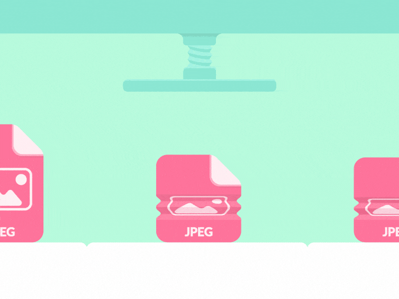

# Compressify


<p align="center">
  
</p>


## Introduction
Compressify is a web application designed to compress images, making them smaller and more manageable without significant loss in quality. This application allows users to upload images directly from their device or via URL, select the desired compression level, compress the images, and download the compressed versions.

You can check out the deployed site here: [Compressify](https://compressify.onrender.com/)

For a detailed overview of the project's development, read the final project blog article here:  
[Compressify Project Blog Article](link-to-blog-article)

### Inspiration

As a developer and general web user, I often find myself dealing with large image files that need to be optimized for web projects or simply need to be stored on my phone or laptop. Some existing online compressors are not that user-friendly. They have lots of settings - technical calibrations and parameters - that might be too complex for a user who just wants to quickly compress an image and move on.

Therefore, I thought it would be a good challenge to design and create an easy-to-use app that a user who is unfamiliar with technical image compression vocabulary would have little trouble using. The goal is to offer a simple, intuitive interface that allows anyone to compress images efficiently without needing to understand the intricacies of image optimization.

## Technical Challenge

<p align="center">
  
</p>

The technical challenge lay in implementing a compression algorithm that balanced file size reduction with minimal loss in image quality. After extensive research and experimentation, I settled on using the Pillow library in Python for image processing. Pillow offered a comprehensive set of tools for opening, manipulating, and saving various image file formats, making it the ideal choice for Compressify. Additionally, I integrated Flask, a micro web framework for Python, to build the backend infrastructure, and SQLAlchemy for database management.

## Resampling Algorithm: Why Lanczos?

One of the critical decisions in developing Compressify was selecting the appropriate resampling algorithm for image resizing. After evaluating several options, including nearest neighbor, bilinear, bicubic, and Lanczos, I ultimately chose Lanczos resampling for its superior performance in preserving image detail and minimizing artifacts.

Lanczos resampling, based on the Lanczos kernel, is known for its ability to produce high-quality results, particularly when downsampling images. Unlike simpler algorithms like nearest neighbor or bilinear interpolation, Lanczos interpolation considers a larger window of pixels, resulting in smoother transitions and sharper details.

By incorporating Lanczos resampling into Compressify, I aimed to ensure that users could resize their images with confidence, knowing that the integrity of their visual content would be preserved as much as possible throughout the compression process.

## Development Journey

The development of Compressify was a journey filled with excitement, challenges, and moments of inspiration. From the initial concept to the final deployment, every step was guided by the vision of creating a user-friendly image compression tool.

- **Planning Phase:** I began by outlining the features and functionalities of the application, sketching wireframes, and defining the project's architecture. This phase involved brainstorming sessions to refine the core idea and identify potential technical hurdles.
- **Implementation:** With a clear roadmap in place, I delved into coding, translating the conceptual framework into a functional application. This phase involved writing backend logic for image compression, setting up database schemas, designing the frontend interface, and integrating various libraries and frameworks.
- **Testing and Iteration:** As development progressed, I conducted rigorous testing to ensure the reliability and performance of Compressify. I solicited feedback from fellow learners who acted as beta testers and iterated on the design and functionality based on their suggestions.
- **Deployment and Launch:** After thorough testing and optimization, Compressify was ready for deployment. I deployed the application to a web server, configured domain settings, and launched it to the public. The excitement of sharing the fruits of my labor with the world was unparalleled.


## Next Iteration and Future Plans

While Compressify has achieved its primary goals of providing image compression functionality with a user-friendly interface, there is always room for improvement. In the next iteration, I envision implementing additional features such as batch image processing, integration with cloud storage services, and support for more advanced compression algorithms.

Furthermore, I aim to enhance the scalability and performance of the application to handle larger volumes of image uploads and compression requests efficiently. This involves optimizing backend processes, adopting caching mechanisms, and leveraging cloud infrastructure for seamless scaling.


<p align="center">
  
</p>


## Features

- Upload images either directly or through URLs
- Choose from various compression levels (10, 25, 50, 75, or 90)
- View compression progress
- Download compressed images
- Delete images from the system


## Technologies Used

- **Flask:** A micro web framework for Python
- **SQLAlchemy:** An SQL toolkit and Object-Relational Mapping (ORM) library for Python
- **APScheduler:** A Python library for scheduling tasks
- **Pillow (Python Imaging Library):** A library for opening, manipulating, and saving many different image file formats
- **SQLite:** A lightweight relational database management system
- **HTML, CSS, JavaScript:** For the frontend user interface
- **HTTP Requests:** Requests library for handling URL uploads


## Installation

1. Clone the repository.

2. Navigate to the project directory:

    ```bash
    cd compressify_image_shrinker
    ```

3. Install dependencies:

    ```bash
    pip install -r requirements.txt
    ```

4. Run the application:

    ```bash
    python app.py
    ```

5. Access the application in your web browser at `http://localhost:5000`.


## Project Structure

- **app.py:** Main application file that initializes Flask, sets up the database, and registers blueprints.
- **routes/:** Contains route definitions for handling different HTTP requests.
    - `main_routes.py`: Defines the main routes for the application.
    - `compression_routes.py`: Defines routes for image compression-related operations.
    - `download_routes.py`: Defines routes for downloading and deleting images.
- **services/:** Contains business logic and helper functions.
    - `compression_service.py`: Functions for compressing images and saving records.
- **static/:** Contains static files like CSS and JavaScript.
    - `script.js`: Handles frontend interactions for uploading and compressing images.
    - `download.js`: Handles frontend interactions for downloading and deleting images.
- **templates/:** Contains HTML templates.
    - `index.html`: Main page template.
    - `download.html`: Template for the download page.
- **config.py:** Configuration settings for the application.


## Usage

1. Navigate to the homepage.
2. Upload an image file or provide a URL to an image.
3. Select the desired compression level using the slider.
4. Click the "Compress" button to initiate the compression process.
5. Monitor the progress of the compression if needed.
6. Once the compression is complete, download the compressed image.
7. Optionally, delete images from the system using the provided functionality.


## Database Schema

The application uses a SQLite database to store information about uploaded and compressed images. The database schema is as follows:

    ImageRecord
    -----------
    id (Primary Key, Integer)
    original_filename (String)
    compressed_filename (String)
    original_size (Integer)
    compressed_size (Integer)
    upload_time (DateTime)


## Author

Erick Siiko: [Connect with me on LinkedIn](https://www.linkedin.com/in/siiko/)


## Related Projects

Some websites and resources that inspired Compressify's design:

- **FreeConvert** - Inspiration for the user interface and layout.
- **ResizePixel** - Ideas for certain features and functionalities.


## License

This project is proprietary software and all rights are reserved. You may not copy, distribute, or modify this software without explicit permission from the author.

For inquiries regarding licensing or use of this software, please contact this account.


---

This README file provides a comprehensive overview of the Compressify project, including its features, setup instructions, and project structure.
